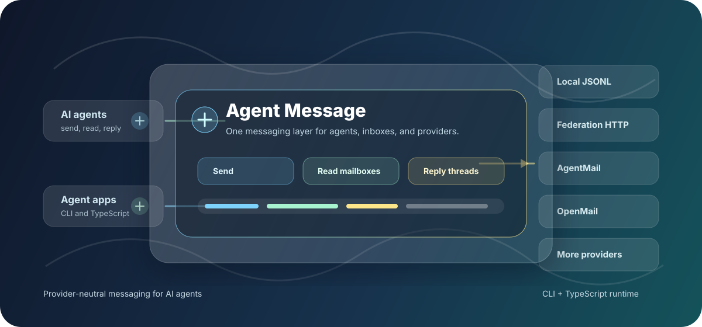

# @codebolt/agent-message

Provider-neutral messaging for AI agents.

<p align="center">
  
</p>

`@codebolt/agent-message` gives agents one CLI and TypeScript runtime for sending messages, reading mailboxes, listing threads, and replying across local, federated, and email-backed providers. It is published as a self-contained package: the CLI, core runtime, federation server, and built-in providers are bundled into this one install.

## Install

```bash
npm install -g @codebolt/agent-message
```

Then initialize config:

```bash
agent-message config init
agent-message config validate
agent-message providers list
```

Requires Node.js 20 or newer.

## Why Use It

Agents should not need a different integration path for every inbox or message provider. Agent Message normalizes the common operations:

- send a direct message
- read mailbox messages
- read and reply to threads
- route by agent, account, contact, provider, and handle
- store local development messages in append-only JSONL
- bridge to remote agents through federation

## Quickstart

Create two local agents and send a message between them:

```bash
agent-message config init
agent-message agents create alice --name "Alice Agent"
agent-message agents create bob --name "Bob Agent"
agent-message --agent alice accounts create local --id alice-local --name "Alice Local" --address local:alice
agent-message --agent bob accounts create local --id bob-local --name "Bob Local" --address local:bob
agent-message contacts create bob --name "Bob Agent"
agent-message contacts add-handle bob --provider local --address local:bob --account bob-local --primary
agent-message --agent alice --account alice-local send --to bob --text "hello from alice"
agent-message --agent bob --account bob-local mailbox list
```

Most commands support `--format json` for agent-readable output:

```bash
agent-message --agent bob --account bob-local --format json mailbox list
```

## Configuration

Config is loaded from:

1. `--config <path>`
2. `AGENT_MESSAGE_CONFIG`
3. `./agent-message.yaml`
4. `~/.config/agent-message/config.yaml`

Message state is stored separately as JSONL under `~/.local/share/agent-message` by default. Override it with `AGENT_MESSAGE_STATE_DIR` or `state.dir` in config.

Minimal config:

```yaml
defaultAgent: default
agents:
  default:
    id: default
    name: Default Agent
providers:
  local:
    id: local
    type: local
    kind: local
accounts:
  default-local:
    id: default-local
    provider: local
    address: local:default
    displayName: Default Agent
    agents:
      - default
contacts: {}
```

## CLI Commands

Configuration:

```bash
agent-message config init
agent-message config path
agent-message config validate
agent-message config doctor
```

Agents, accounts, contacts, and providers:

```bash
agent-message agents list
agent-message agents show <agentId>
agent-message agents create <agentId> --name <name>
agent-message agents current
agent-message accounts list
agent-message accounts show <accountId>
agent-message accounts setup <provider>
agent-message accounts create <provider> --id <accountId> --name <name> --address <address>
agent-message contacts list
agent-message contacts show <contactId>
agent-message contacts search <query>
agent-message contacts create <contactId> --name <name>
agent-message contacts add-handle <contactId> --provider <provider> --address <address>
agent-message providers list
agent-message providers capabilities <provider>
```

Messaging:

```bash
agent-message --agent <agentId> --account <accountId> send --to <contact-or-address> --text <message>
agent-message --agent <agentId> --account <accountId> mailbox list
agent-message --agent <agentId> --account <accountId> messages read <messageId>
agent-message --agent <agentId> --account <accountId> threads list
agent-message --agent <agentId> --account <accountId> threads read <threadId>
agent-message --agent <agentId> --account <accountId> threads reply <threadId> --text <message>
```

Federation server:

```bash
agent-message server init
agent-message server start --host 127.0.0.1 --port 8787
```

## Built-In Providers

| Provider | Type | Notes |
| --- | --- | --- |
| Local | `local` | JSONL-backed local development provider |
| Federation | `federation` | HTTP provider for remote agent-message servers |
| AgentMail | `agentmail` | Uses `AGENTMAIL_API_KEY` by default |
| OpenMail | `openmail` | Uses `OPENMAIL_API_KEY` by default |
| Robotomail | `robotomail` | Uses `ROBOTOMAIL_API_KEY`; supports `settings.domainId` |
| Nuntly | `nuntly` | Uses `NUNTLY_API_KEY`; supports `settings.domainId` or `settings.namespaceId` |
| Lumbox | `lumbox` | Uses `LUMBOX_API_KEY` by default |
| AGMail | `agmail` | Uses `AGMAIL_API_KEY`; supports `settings.domain` |

Provider auth can be customized in config:

```yaml
providers:
  agentmail:
    id: agentmail
    type: agentmail
    kind: email
    auth:
      apiKeyEnv: AGENTMAIL_API_KEY
```

## TypeScript API

```ts
import {
  ProviderRegistry,
  JsonlEventStore,
  localProvider,
  agentMailProvider,
  loadConfig,
  type ProviderAdapter,
} from "@codebolt/agent-message";

const loadedConfig = await loadConfig();
const registry = new ProviderRegistry();
registry.register(localProvider);
registry.register(agentMailProvider);

const store = new JsonlEventStore(loadedConfig.stateDir);
const provider: ProviderAdapter = registry.get("local");
```

The package exports the provider contract, config helpers, routing helpers, JSONL event store, built-in providers, CLI helpers, and federation server helpers.

## Publishing Shape

This package is intentionally self-contained. The internal workspace packages are private build units and are bundled into `@codebolt/agent-message`; consumers only need to install this package.
